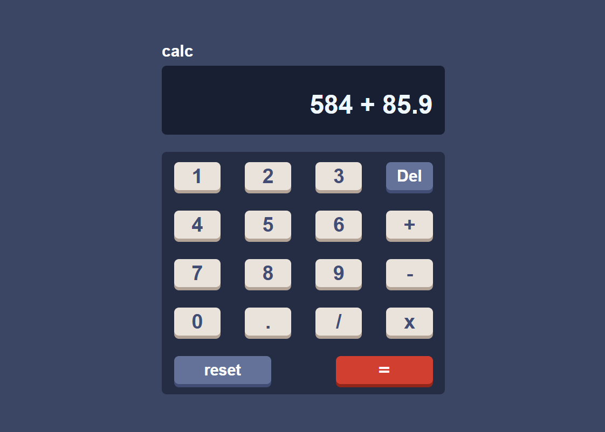

# Calculator Project

A simple web-based calculator built with **HTML**, **CSS**, and **JavaScript**.  
It supports basic arithmetic operations: addition, subtraction, multiplication, and division.  
The last result is saved in the browser, so you can continue calculations easily.

## Features

- Simple and clean user interface
- Supports numbers with decimal points
- Maximum of 7 digits per number
- Delete, Reset, and Equal buttons
- Stores the last result in local storage

## How to Use

1. Open `index.html` in your web browser.
2. Click the buttons to enter numbers and operators.
3. Press `=` to get the result.
4. Press `Reset` to clear all inputs.
5. Press `Del` to remove the last entered digit or operator.

## Technologies

- HTML
- CSS
- JavaScript

## Author

Your Name
